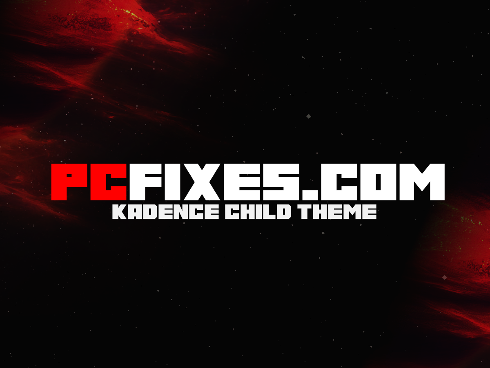

# Kadence Child Theme
## Standardized theme to provide an interface through which a Kadence-backed website can be populated with content, CPT's, sections and users via a JSON file

### RPECK 13/07/2023 - Add standardisation to Kadence

Provide the means to customise Kadence in a standard way.

Our system uses a set of functionality to provide a standardised way to populate Kadence based websites.

The aim is to have a JSON payload that can be used to build out most of the website

---

:copyright:  